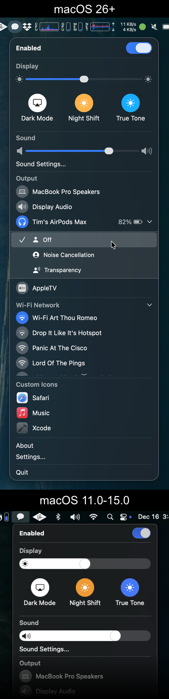

# Mac Control Center UI

[](https://developer.apple.com/swift) [](https://swiftpackageindex.com/orchetect/MacControlCenterUI) [](https://developer.apple.com/swift) [](https://github.com/orchetect/MacControlCenterUI/blob/main/LICENSE)




A **menu builder** and **suite of SwiftUI controls** that closely mimics the look, feel, and animations of **macOS Control Center** menus.

Integrates seamlessly with SwiftUI's `MenuBarExtra`.

Both **Dark** and **Light Mode** are fully supported.

## Getting Started

### Swift Package Manager (SPM)

1. Add MacControlCenterUI as a dependency using Swift Package Manager.

   - In an app project or framework, in Xcode:

     Select the menu: **File → Swift Packages → Add Package Dependency...**

     Enter this URL: `https://github.com/orchetect/MacControlCenterUI`

   - In a Swift Package, add it to the Package.swift dependencies:

     ```swift
     .package(url: "https://github.com/orchetect/MacControlCenterUI", from: "2.7.0")
     ```

2. Import the library:

   ```swift
   import MacControlCenterUI
   ```

3. Try the [Demo](Demo) example project to see all of the available controls in action.

## Requirements

Minimum requirements to compile: Xcode 14 on macOS 12.5 or newer.

Supports macOS 11.0+ once compiled.

## Known Issues

- Due to the lacklustre implementation of window resize behavior in SwiftUI, animations are kept to a bare minimum on macOS 15 and earlier. macOS 26 introduces improvements to how SwiftUI resizes windows as a result of animating view size changes, and these benefits will be conditionally available in this library when running on macOS 26.


## Author

Coded by a bunch of 🐹 hamsters in a trenchcoat that calls itself [@orchetect](https://github.com/orchetect).

## License

Licensed under the MIT license. See [LICENSE](https://github.com/orchetect/MacControlCenterUI/blob/master/LICENSE) for details.

## Sponsoring

If you enjoy using MacControlCenterUI and want to contribute to open-source financially, GitHub sponsorship is much appreciated. Feedback and code contributions are also welcome.

## Community & Support

Please do not email maintainers for technical support. Several options are available for issues and questions:

- Questions and feature ideas can be posted to [Discussions](https://github.com/orchetect/MacControlCenterUI/discussions).
- If an issue is a verifiable bug with reproducible steps it may be posted in [Issues](https://github.com/orchetect/MacControlCenterUI/issues).

## Contributions

Contributions are welcome. Posting in [Discussions](https://github.com/orchetect/MacControlCenterUI/discussions) first prior to new submitting PRs for features or modifications is encouraged.
