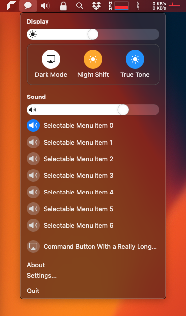

# Mac Control Center UI

[](https://developer.apple.com/swift)  [](https://developer.apple.com/swift) [](https://github.com/orchetect/MacControlCenterUI/blob/main/LICENSE)



A suite of SwiftUI views that mimic the look and feel of controls used in **macOS Control Center** (introduced in Big Sur).

Careful attention has been paid to **reproducing small details**, such as the slider knob gradually fading as it approaches the image overlay, and the sound slider image overlay changing between muted, low, medium, and high volume symbols to match macOS's Control Center behavior.

Both **Dark** and **Light Mode** are fully supported.

## Getting Started

### Swift Package Manager (SPM)

1. Add MacControlCenterUI as a dependency using Swift Package Manager.

   - In an app project or framework, in Xcode:

     - Select the menu: **File → Swift Packages → Add Package Dependency...**
     - Enter this URL: `https://github.com/orchetect/MacControlCenterUI`

   - In a Swift Package, add it to the Package.swift dependencies:

     ```swift
     .package(url: "https://github.com/orchetect/MacControlCenterUI", from: "1.0.0")
     ```

2. Import the library:

   ```swift
   import MacControlCenterUI
   ```

3. Try the [Demo](Demo) example project to see all of the available controls in action.

## Requirements

Minimum requirements to compile: Xcode 12 on macOS 10.15 Catalina or newer.

Supports macOS 10.15+ once compiled. Menu builder is available on macOS 13.0+.

## Author

Coded by a bunch of 🐹 hamsters in a trenchcoat that calls itself [@orchetect](https://github.com/orchetect).

## License

Licensed under the MIT license. See [LICENSE](https://github.com/orchetect/MacControlCenterUI/blob/master/LICENSE) for details.

## Contributions

Contributions are welcome. Feel free to post an Issue to discuss.
